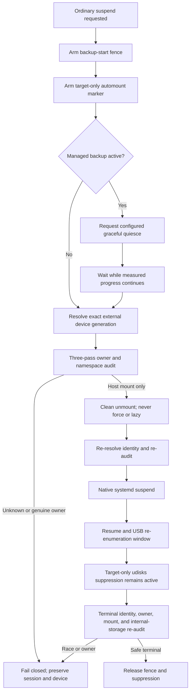

# External Storage Safe Suspend for Linux

[](https://github.com/aagprojectsteam-max/aag-external-storage-safe-suspend-linux/actions/workflows/ci.yml)
[](LICENSE)

`aag-external-storage-safe-suspend-linux` protects one explicitly selected
external backup disk across ordinary Linux suspend. It cleanly releases the
external filesystems before sleep, keeps designated internal storage mounted,
and closes the GNOME/udisks automount race after the USB bridge re-enumerates on
resume.

It is for Ubuntu desktop users whose USB-attached NVMe backup storage can
disconnect or re-enumerate during s2idle. Suspending while backup writers,
hidden mount-namespace users, raw block consumers, or newly automounted
filesystems still own that device risks an unclean release. This project adds a
fail-closed transaction around the native suspend path; it does not replace
backups or fix controller firmware.

## What happens



- Internal mounts listed with `--protect-mount` are identity-checked and never
  unmounted.
- The external device is selected by underlying serial, USB bridge IDs, and the
  exact filesystem UUID set. A current `/dev/sdX` name is only an action handle
  after identity and kernel-generation checks.
- Mount namespaces and open file, cwd, root, executable, mmap, raw block,
  DM/NBD/loop, container, and guest relationships are audited.
- Stable host mounts and propagated Snap/systemd sandbox mirrors are not
  mistaken for independent owners. Permission gaps, changing topology, or real
  writers fail closed.
- Managed backup software receives only its configured graceful action. The
  wait extends while measured progress continues; there is no universal
  50-second cleanup deadline and no generic `kill -9`.
- The generated udev rule suppresses udisks automount only for the configured
  device's exact partitions and only while a boot-scoped transaction marker
  exists. Unrelated USB media retains normal desktop behavior.
- The installer and uninstaller never suspend, reboot, shut down, or power off.

## Tested reference platform

Physical acceptance passed on Ubuntu Desktop 26.04 LTS, GNOME on Wayland,
s2idle, an external NVMe drive in a UGREEN enclosure using a Realtek RTL9210
bridge, and optional Timeshift integration. The accepted cycle recorded one PM
suspend entry and exit, 90.077358 seconds of hardware sleep, zero target
automounts after resume, all target filesystems unmounted at terminal, unchanged
internal storage, a continued user session, and zero orderly-poweroff requests.

See [tested hardware](docs/TESTED-HARDWARE.md) and the normalized
[acceptance record](docs/ACCEPTANCE.md). Those results validate that reference
platform, not every enclosure, filesystem, desktop, kernel, or firmware.
The public release's independent retrieval checks are recorded in
[publication verification](docs/PUBLICATION-VERIFICATION.md).

## Install

Download `aag-external-storage-safe-suspend-linux-v1.0.0.run` and `SHA256SUMS`
from the [v1.0.0 release], then verify before running:

```bash
sha256sum --ignore-missing -c SHA256SUMS
chmod +x aag-external-storage-safe-suspend-linux-v1.0.0.run
sudo ./aag-external-storage-safe-suspend-linux-v1.0.0.run install \
  --device /dev/disk/by-id/your-external-backup-disk \
  --protect-mount /mnt/data \
  --timeshift
```

`--device` is used once for discovery; the installed configuration never relies
on that volatile name. Omit `--timeshift` if Timeshift is not part of the backup
path. Repeat `--protect-mount` for every important internal mount. `/` is always
protected. The installer validates the discovered stable identity, installed
hashes, udev syntax, merged systemd graph, and protected mounts, and performs no
sleep test.

Review status before a first supervised test:

```bash
sudo /usr/local/libexec/aag-safe-suspend validate
sudo /usr/local/libexec/aag-safe-suspend status
```

Close applications that intentionally use the external disk, keep the machine
on a hard ventilated surface with AC power, and make the first ordinary suspend
cycle supervised. Do not use a bag or leave the machine unattended until that
platform's acceptance is complete.

## If a backup or release blocks sleep

A registered Timeshift job cannot start after the fence is armed. An already
running managed job is asked to quiesce only when an explicit command is
configured, then is observed with a progress-aware wait. A genuine writer,
independent namespace, raw consumer, observability gap, identity change, or
failed clean unmount blocks suspend. The software does not force-unmount or kill
unknown applications.

Failure recovery preserves the user session. With the default thermal policy,
even an emergency condition remains fail closed without a power action. An
opt-in orderly poweroff exists only as a last physical-safety fallback; it is
not the normal suspend path. See [the safety model](docs/SAFETY-MODEL.md).

## Uninstall and rollback

Use the same verified release asset:

```bash
sudo ./aag-external-storage-safe-suspend-linux-v1.0.0.run uninstall
```

The uninstaller refuses while the fence or a conflicting systemd job is active,
checks project-owned hashes, removes only project files, and safely reverses its
Timeshift diversions. It removes the project device configuration but preserves
user data and durable transaction evidence. It never performs a power-state
action.

## Scope and limitations

Tested behavior and design support are deliberately different:

- **Tested on:** the reference platform above, with ext4 filesystems on the
  target and an RTL9210 bridge.
- **Supported by design:** Ubuntu-family systemd desktops, one USB-attached
  whole-disk target whose every partition has a unique filesystem UUID,
  changing `/dev/sdX` generations, and unrelated removable media appearing at
  the same time.
- **Untested:** other distributions, non-systemd suspend, other desktops,
  Thunderbolt/PCIe hotplug, encrypted or stacked target filesystems, multiple
  protected external disks, and non-ext4 physical acceptance.
- **Known limitations:** a disk with unformatted or UUID-less partitions is
  rejected; unexpected systemd jobs fail the installer closed; firmware/kernel
  hangs remain outside software guarantees; Timeshift integration covers the
  diverted CLI/GTK entry points, not arbitrary direct execution of private
  binaries.
- **Hibernate:** experimental/unsupported. It was not separately accepted and
  this project does not enable hibernate or suspend-then-hibernate.
- **Modem/GNSS:** no modem code or evidence is included. Coexistence was tested
  on the reference machine only through generic integration boundaries.

Further reading: [architecture](docs/ARCHITECTURE.md),
[GNOME/udisks race](docs/GNOME-UDISKS-AUTOMOUNT.md),
[RTL9210 behavior](docs/RTL9210.md), [Timeshift](docs/TIMESHIFT.md), and
[troubleshooting](docs/TROUBLESHOOTING.md).

## Development

The test corpus is synthetic and privacy-safe:

```bash
make check
make release-check
```

The project is licensed under the [MIT License](LICENSE). Storage-safety flaws
should be reported privately according to [SECURITY.md](SECURITY.md).

[v1.0.0 release]: https://github.com/aagprojectsteam-max/aag-external-storage-safe-suspend-linux/releases/tag/v1.0.0
